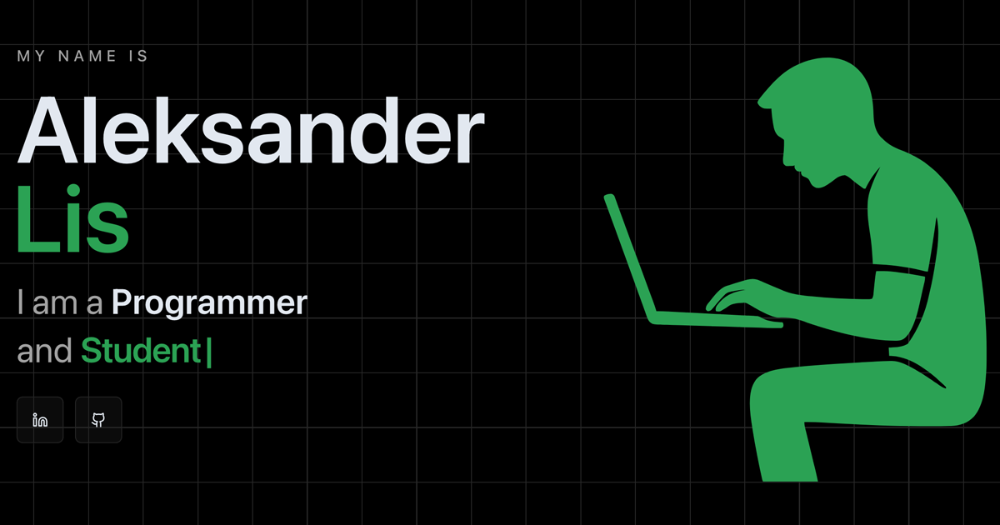

<div align="center">

# Portfolio

  <p>
    <strong>My private portfolio built in Next.js</strong>
  </p>

  <p>
    
  </p>

  <p>
    
    
    
    <br />
    
    
  </p>
  <p>
     
     
  </p>
</div>

---

## 🚀 Overview

This is my personal portfolio website with a hero intro, skills showcase, project highlights,
career timeline, and a contact form. The UI leans on bold typography, a grid-driven layout, and
purposeful motion to keep the content focused while still feeling alive. It is structured to be
easy to iterate on, so updating copy or sections stays fast and predictable.

## 🛠️ Local setup

Clone the repo and install dependencies:

```bash
git clone https://github.com/alwoodm/portfolio.git
cd portfolio
pnpm install
```

Copy the env file and fill values:

```bash
cp .env.example .env
```

Start the dev server:

```bash
pnpm dev
```

## 🔐 Environment variables

Set these in `.env`. Start with `PORT=3000` and
`NEXT_PUBLIC_APP_URL=http://localhost:3000` for canonical URLs. Use
`NEXT_PUBLIC_ICONIFY_API_URL=https://api.iconify.design` for Iconify. For the contact form, set
`RESEND_API_KEY=`, `RESEND_FROM_EMAIL=`, and optionally `RESEND_FORWARD_TO=` using
[Resend](https://resend.com). The content update API uses `ADMIN_TOKEN=`.

## 🧰 Development commands

Use `pnpm dev` to start the dev server. Run `pnpm lint` to check ESLint and
`pnpm lint --fix` to auto-fix issues. For formatting, use `pnpm format:check` or
`pnpm format` to write changes. Type checks run with `pnpm tsc --noEmit`, builds with
`pnpm build`, and the production server with `pnpm start`.

## ✍️ Content and contact

Content lives in `data/*.json` and is rendered directly by the pages. You can edit these files
manually or update them via `POST /api/content/<file>` using the `x-admin-token` header.

The contact form posts to `/api/contact` and relies on the `RESEND_*` env vars configured above to
send and optionally forward inbound emails.

## 📄 License

This project is licensed under the terms described in [LICENSE](./LICENSE).
